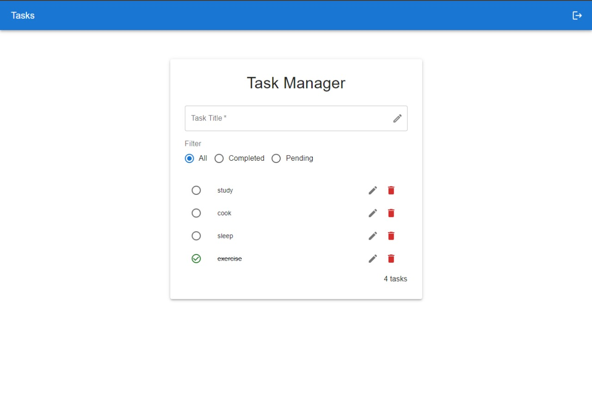

# Task Manager

## Introduction

This is a single-page task management web application built with React.js in the frontend and using Express and Mongoose in the backend. It allows users to add, delete, reorder and filter tasks based on their completion status.

## Features

- **Task List Display**: Tasks are displayed with their title and status (completed or pending).
- **Add Task**: Users can add new tasks with input validation to prevent empty entries.
- **Toggle Task Status**: Tasks can be marked as completed or pending with a simple click.
- **Filter Tasks**: Users can filter tasks by status (all, completed, pending).
- **Delete Task**: Tasks can be deleted with a confirmation dialog to prevent accidental deletions.
- **Responsive Design**: The application is fully responsive and works on desktop and mobile devices.
- **Authentication**: Users can register and sign in to save their tasks.
- **Drag and Drop**: Tasks can be reordered by dragging and dropping them.

## Setup and Installation

To get this project running on your local machine, follow these steps:

1. Clone the repository: Get a copy of the source code on your local machine.
2. Set up environment variables: Before starting your server, you'll need to create an .env file in the root of your server directory and add the following environment variables:
JWT_KEY: This is your secret key for signing JSON Web Tokens. For example, you could set it as `JWT_KEY='your_secret_key'`.
DB_URL: This is the URL for your MongoDB database instance. For example, use `DB_URL='mongodb://0.0.0.0:27017'` to connect to a database running locally on the default MongoDB port.
3. Install the necessary packages and MongoDB: Install all required dependencies for both the backend and frontend of the application.
4. Start the backend server: Launch your Node.js/Express backend to serve the API endpoints your frontend will interact with.
5. Start the React application: Run your React frontend which will communicate with the backend and allow users to interact with the application.

## Technologies Used
Frontend: React.js (with Redux) with Material-UI
Backend: Node.js, Express.js
Database: MongoDB with Mongoose

## Screenshots
